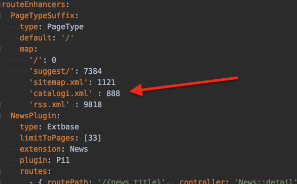

.. include:: ../Includes.txt

.. _installation:

============
Installation
============

Target group: **Administrators / Developers**

* composer req proudnerds-typo3/pn-uniform-product-names
* include the typoscript template
* add the new page and uniform product fields to the editor backend user groups
* adjust typoscript settings for spatial and authority. This extension is default configured for a Dutch municipal
* add the scheduler task to import the product names, it can be found under "Execute console commands". The source XML is updated 4 times a year, according to ICTU.nl. You can also run this task in the console the first time to have some more log info. See Classes/Command/ImportCommand.php for howto. A log is created at /var/log/productNames-import.log
* if you want to migrate from alternet_sc_pages, you can run the migrate script as a one time scheduler task or better run it from console.
* at the page properties now is a tab with fields for Uniforme Productnamen
* to be able to show https://www.yourwebsite.nl/catalogi.xml, add a routeEnhancer mapping for 888 in /config/sites/yourwebsite/config.yaml :

More info
=========

* For an introduction on SC, please read Documentation/Extra/IPM-Samenwerkende-Catalogi.pdf. Details and requirements of the catalogi.xml structure, see chapter 3
* SC XML validator https://scvalidator.logius.nl/